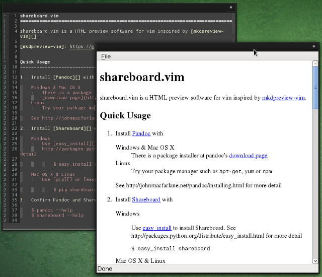
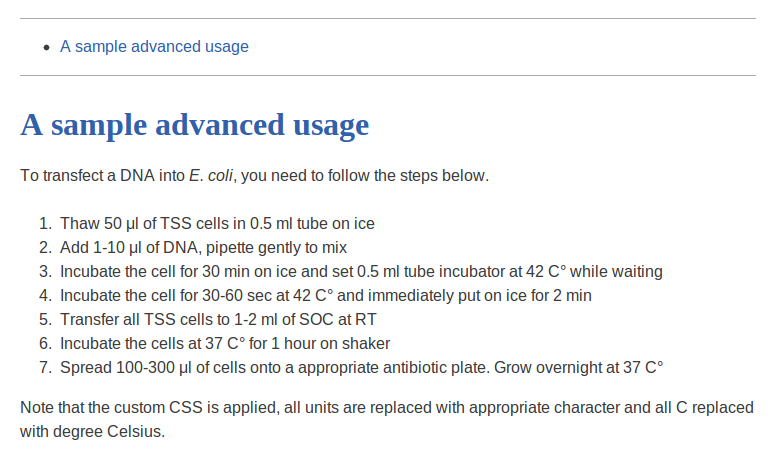

shareboard.vim
=============================================================================

Version:   0.1.5rc4

shareboard.vim is a HTML preview software for vim inspired by [mkdpreview-vim][].

[mkdpreview-vim]: https://github.com/mattn/mkdpreview-vim

Quick Usage
-----------------------------------------------------------------------------
See [Packages](#packages) to install in Arch Linux.

1.  Install [Pandoc][] with

    **Windows & Mac OS X**
    There is a package installer at pandoc's
    [download page](http://code.google.com/p/pandoc/downloads/list)

    **Linux**
    Try your package manager such as `apt-get`, `yum` or `rpm`

    See http://johnmacfarlane.net/pandoc/installing.html for more detail

2.  Install [Shareboard][] with

    **Windows**
    Use [easy_install][] to install Shareboard. See
    http://packages.python.org/distribute/easy_install.html for more detail

        $ easy_install shareboard

    **Mac OS X & Linux**
    Use [pip][] or [easy_install][] to install Shareboard. You may need to use `sudo`.

        $ pip install shareboard

    After that, **you have to install [Qt][] and [PySide][] to enable shareboard viewer**

3.  Confirm Pandoc and Shareboard are correctly installed with command below

    $ pandoc --help
    $ shareboard --help

4.  Create `helloworld.md` and write some Markdown, type `<Leader>v` to show
    Shareboard viewer

[easy_install]: http://packages.python.org/distribute/easy_install.html
[pip]: http://www.pip-installer.org/en/latest/
[Qt]: http://qt.digia.com/
[PySide]: http://qt-project.org/wiki/PySide

Require
-----------------------------------------------------------------------------
-   Python
-   [Shareboard][]
    -   [Qt][]
    -   [PySide][]
-   [Pandoc][] (Reqiured if you want to use as default settings)

Install
-----------------------------------------------------------------------------

shareboard.vim use [Shareboard][] to display the preview, so you have to install
it with the commands below

    $ pip install shareboard

And also, you have to install [Qt][] and [PySide][] to enable shareboard
builtin HTML viewer.

After you install Shareboard, you can install shareboard.vim with [vim-pathogen][]
, [vundle][] or simply copy the files into your `.vim` directory

And also, if you want to use shareboard.vim with [Markdown][],
[reStructuredText][], or [Textile][] file, you need to install [Pandoc][] to
convert these types of files into HTML file.

If you want to use different programs to convert files such as [Markdown.pl][],
you can change `g:shareboard_command` variable.

[Shareboard]: https://github.com/lambdalisue/Shareboard
[vim-pathogen]: https://github.com/tpope/vim-pathogen
[vundle]: https://github.com/gmarik/vundle
[Markdown]: http://daringfireball.net/projects/markdown/
[reStructuredText]: http://docutils.sourceforge.net/rst.html
[Textile]: http://textile.thresholdstate.com/
[Pandoc]: http://johnmacfarlane.net/pandoc/
[Markdown.pl]: http://search.cpan.org/~sekimura/Text-Markdown-Discount-0.04/xt/MarkdownXS.pl

Usage
-----------------------------------------------------------------------------

In default, shareboard.vim activate two key mappings in following file type

-   Html
-   Markdown
-   reStructuredText
-   Textile

The key mappings activated are

`<Leader>v`
Show the preview window. After you show the preview window, the preview
will automatically be updated when you save the file with `:w` command

`<Leader>c`
Compile the data with command specified in `g:shareboard_command`

Configure
-----------------------------------------------------------------------------

### Variables

`g:shareboard_path`
Specify the path of Shareboard. Default is `shareboard`

`g:shareboard_host`
Specify the host name of Shareboard server. Default is `localhost`

`g:shareboard_port`
Specify the port number of Shareboard server. Default is `8081`

`g:shareboard_command`
Specify the compile command. Default is `pandoc -Ss --webtex -t html`

`g:shareboard_compile_ext`
Specify the ext name of compiled file. Default is `.html`

### Functions

`ShareboardStart`
Start Shareboard server with specified settings. It also execute

`ShareboardUpdate`
Update Shareboard with the current buffer. The Shareboard must be exected
before.

`ShareboardPreview`
Call `ShareboardStart` and `ShareboardUpdate`

`ShareboardCompile`
Compile current buffer with specified settings.

### Key mappings

`<Leader>v`
Show the preview window. After you show the preview window, the preview
will automatically be updated when you save the file with `:w` command

`<Leader>c`
Compile the data with command specified in `g:shareboard_command`

Advanced usage
-----------------------------------------------------------------------------

### Custom arguments
[Pandoc][] can use custom arguments such as custom CSS or Bibliography.
In shareboard.vim, you can simply apply these custom argument with
`g:shareboard_command` like

    let g:shareboard_command = printf('pandoc -sS --toc --webtex -c "%s" --bibliography="%s"',
        \ expand("~/.vim/shareboard/main.css"),
        \ expand("~/.vim/shareboard/library.bib"))

See http://johnmacfarlane.net/pandoc/demos.html to find available arguments.

### Replace text before Pandoc
shareboard.vim use a command specified with `g:shareboard_command` so you can
simply apply Shell script to this variable to modify the text before passing it
to the Pandoc like

    let g:shareboard_command = expand("~/.vim/shareboard/command.sh")

    # ~/.vim/shareboard/command.sh
    #!/usr/bin/env bash

    CSS="~/.vim/shareboard/main.css"
    BIB="~/.vim/shareboard/library.bib"
    TEXT=`cat /dev/stdin`

    # Replace [0-9] u[mMgl] -> [0-9] &mu;[mMgl] (e.g. 10 ul -> 10 &mu;l)
    TEXT=`echo "$TEXT" | sed 's/\([0-9]\) u\([mMgl]\)/\1 \&mu;\2/g'

    # Replace &celsius; -> &deg;C
    TEXT=`echo "$TEXT" | sed 's/\&celsius;/\&deg;C/g'

    # See the link below to all replacement I daily use.
    # https://github.com/lambdalisue/dotfiles/blob/master/vim/shareboard/command.sh

    # Convert with Pandoc
    TEXT=`echo "$TEXT" | pandoc -sS --toc --webtex -c "$CSS" --bibliography="$BIB" 2>/dev/null`

    # return
    echo "$TEXT"

With this `command.sh`, shareboard.vim will preview the text below to the screenshot below.

    A sample advanced usage
    =======================================

    To transfect a DNA into *E. coli*, you need to follow the steps below.

    1.  Thaw 50 ul of TSS cells in 0.5 ml tube on ice
    2.  Add 1-10 ul of DNA, pipette gently to mix
    3.  Incubate the cell for 30 min on ice and set 0.5 ml tube incubator at 42 C while waiting
    4.  Incubate the cell for 30-60 sec at 42 C and immediately put on ice for 2 min
    5.  Transfer all TSS cells to 1-2 ml of SOC at RT
    6.  Incubate the cells at 37 C for 1 hour on shaker
    7.  Spread 100-300 ul of cells onto a appropriate antibiotic plate. Grow overnight at 37 C

    Note that the custom CSS is applied, all units are replaced with appropriate character and all C replaced with degree Celsius.

Packages
----------------------------------------------------------------------------
Currently packages of shareboard.vim and [Shareboard][] are available in only
Arch Linux

-   Arch Linux (Thank [Anntoin](https://github.com/lambdalisue/shareboard.vim/issues/1#issuecomment-13129299))

    -   [Package for Shareboard](https://aur.archlinux.org/packages/python2-shareboard-git/)
    -   [Package for shareboard.vim](https://aur.archlinux.org/packages/vim-shareboard-git/)
